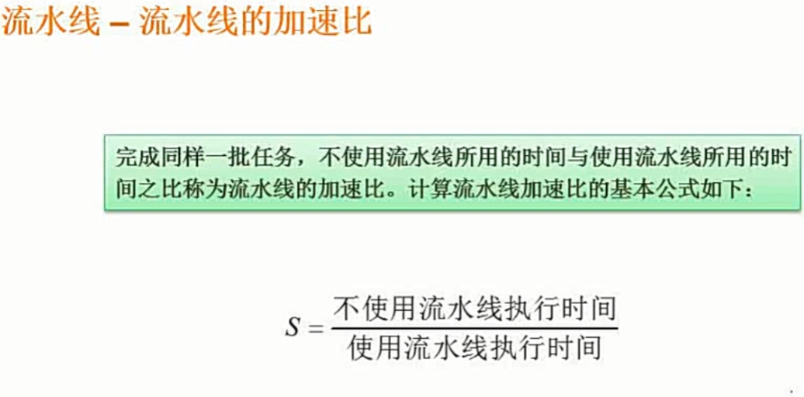
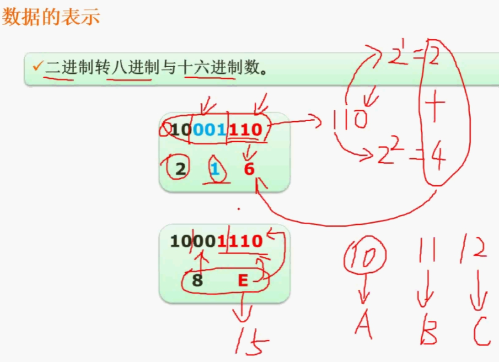
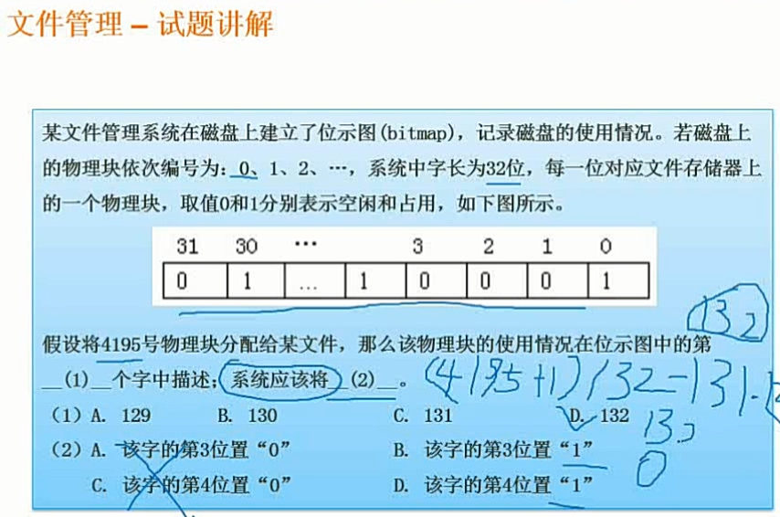
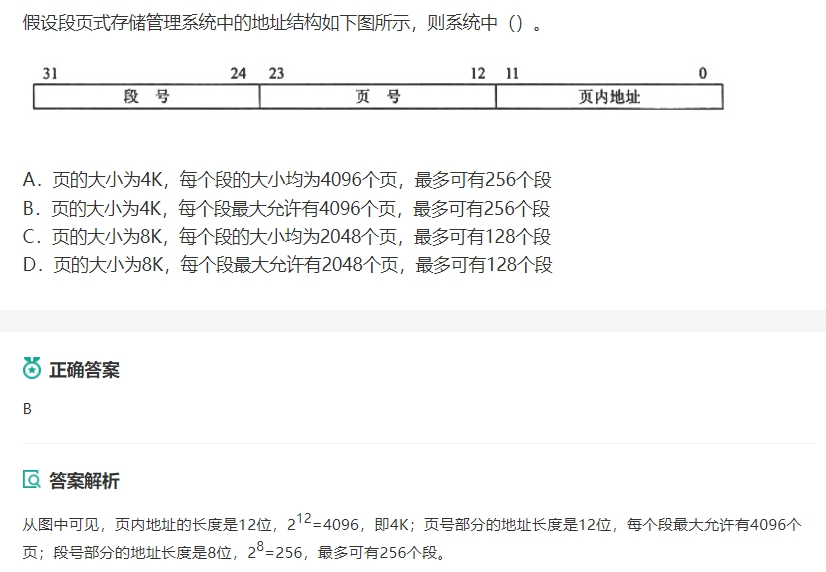

# 一.计算机系统知识


## 1.1 原码反码补码移码

正数时

> 原=反=补

负数时

> 原转反：符号位不变，其余取反
>
> 反转补：最低位加1

移码：当偏移量为2的n-1次方时，**将补码符号位取反即可**，移码只用于表示浮点数的阶码，所以只用于整数。

**零只有唯一补码**


## 1.2 定点数浮点数

定点数指小数点位置不变的数，分为定点整数和定点小数。**小数点不需要存储位**


浮点数表示方法

```math
N = M*R^E
```

> - M为尾数：决定了浮点数的表示精度
> - R为基数
> - E为阶码：指出了小数点在数据中的位置，决定了浮点数的表示范围大小，若超出计算机的表达范围，则溢出


其中r是浮点数阶码的底，与尾数的基数相同，通常r=2。E和M都是带符号的定点数，E叫做阶 码，M叫做尾数。浮点数的一般格式如图所示，浮点数的底是隐含的，在整个机器数中不出现。阶 码的符号位为Es，阶码的大小反映了在数N中小数点的实际位置；尾数的符号位为Ms，它也是整个 浮点数的符号位，表示了该浮点数的正、负。


### 浮点数计算

在数学中，要表示一个很大的数时，我们常常使用一种称为科学计数法的方式：

N=M*Re 

其中M称为尾数，e是指数，R为基数。 

浮点数就是使用这种方法来表示大范围的数，其中指数一般是2，8，16。而且对于特定机器而 言，指数是固定不变的，所以在浮点数中指数并不出现。从这个表达式可以看出：浮点数表示的精 读取决于尾数的宽度，范围取决于基数的大小和指数的宽度。 

浮点数的运算主要有三个步骤：对阶、尾数计数、结果格式化。 

> 1. 对阶：首先计算两个数的指数差，把指数小的向指数大的对齐，并将尾数右移指数差的位数，这样两 个浮点数就完成了对阶的操作。可以看出，对阶的过程可能使得指数小的浮点数失去一些有效位。 如果两个浮点数阶数相差很大，大于指数小的浮点数的尾数宽度，那么对阶后那个浮点数的尾数就 变成了0，即当做机器零处理了。 具体方法是：**阶码小的那个尾数右移，移位的次数等于参 加运算的两个数的阶码之差**。
> 2. 尾数计算：对阶完成后，两个浮点数尾数就如同定点数，计算过程同定点数计算。 
> 3. 结果格式化：尾数计算后，可能会产生溢出，此时将尾数右移，同时指数加1，如果指数加1后发生了溢出， 上一节 本书简介 下一节 第 1章：计算机硬件基础知识 作者：希赛教育软考学院 来源：希赛网 2014年05月04日 一点一练 则表示两个浮点数的运算发生了溢出。 如果尾数计算没有溢出，则尾数不断左移，同时指数减1，直到尾数为格式化数。如果这个过程 中，指数小于机器能表达的最小数，则将结果置“机器零”，这种情况称为下溢。


## 1.3校验码

确保数据传送无误，码距是指一个编码系统中任意两个合法编码之间至少有多少个二进制位不同

> - 提高硬件电路的可靠性
> - 提高代码的检验能力


### 1.3.1 奇偶校验码

使码距为2

> - 水平奇偶校验码
> - 垂直奇偶校验码
> - 水平垂直奇偶校验码


### 1.3.2 海明码

在数据位之间插入k个校验码，**扩大码距来实现检错和纠错**，

设数据位是n位，校验位k位，则满足

```math
2的k次方 -1 >= n+k
```


### 1.3.3 循环冗余校验码(CRC)


校验码越长，该代码校验能力越强，采用模2运算，其加减运算的规则是按位运算，不发生借位和进位


使用模2运算不计其进位，使用异或，即相同为0，不相同为1


例如


步骤

> - 根据多项式得出被除数为11011
> - 除数后面补0，补的数量为被除数的数量-1
> - 进行模2异或运算
> - 将余数填充到除数后面替代补上去的0


## 1.4计算机系统硬件组成

**组成**

- 运算器
- 控制器
- 存储器
- 输入设备
- 输出设备


### 1.4.1 中央处理单元(CPU)

主要功能

> - 指令控制
> - 操作控制
> - 时间控制
> - 数据加工

组成

> - 运算器
>
> > - **算术逻辑单元(ALU)**:运算器重要组成部件，负责处理数据，实现对数据的算术运算和逻辑运算
> > - **累加寄存器(AC)**:通用寄存器，当ALU工作时，提供一个工作区
> > - **数据缓冲寄存器(DR)**:在对存储器进行读写操作室，用DR暂时存放由由内存储器读写的一条指令或一个数据字，并将不同时间段内读写的数据隔离开来
> > - **状态条件寄存器(PSW)**:主要分为`状态标志`和`控制标志`，这些标志通常分别由一位触发器保存，反映了当前指令执行完成之后的状态。一个算术操作产生一个运算结果，一个逻辑产生一个判决
>
> - 控制器
>
>   它决定了计算机运行过程的自动化
>
>  > - **指令寄存器(IR)**
>  > - **程序计数器(PC)**
>  > - **地址寄存器(AR)**
>  > - **指令译码器(ID)**
>
> - 寄存器组：控制器和运算器中的寄存器都是专用寄存器，通用寄存器可由程序员规定其用途


CPU与外设之间交换数据的方式

> - 直接程序控制方式
>
>   > - 无条件传送：外设总是准备好的，可以无条件接受CPU输入输出的数据
>   > - 程序查询：需要CPU查询外设的状态，判断是否准备好
>
> - 中断方式：当IO与外设交换数据时，CPU无需等待，也不必查询IO状态，可以处理其他任务。当完成数据传输后，会向CPU发送中断信号
>
> - 直接存储器存取方式：与上面两个需要CPU执行程序不同，通过硬件实现主存与IO设备的直接数据传送，不需要CPU干涉
>
> - 通道控制方式


## 1.5存储系统


### 1.5.1 按位置分类

> - 内存
> - 外存


### 1.5.2 按材料分类

> - 磁存储器
> - 半导体存储器
> - 光存储器


### 1.5.3 按工作方式

> - 读写存储器
> - 只读存储器


### 1.5.4 按访问方式分类

> - 按地址访问
> - 按内容访问:例如相联存储器


### 1.5.5 按寻址方式访问

> - 随机存储器(RAM)
> - 顺序存储器(SAM)
> - 直接存储器(DAM)：在`主存与外设`之间建立了直接的数据通路


**相联存储器**：按内容访问的存储器，通过关键字比较，可用在高速缓冲存储器中，在虚拟存储器中用来做段表等，还可用在数据库中

**高速缓存(Cache)**

目的：提高存储器平均访问速度，使存储器速度与cpu速度相匹配，地址变换和数据块的替换算法均由**硬件**实现。通常被集成到cpu的寄存器中，容小，速快，成高


常用的虚拟存储器由**主存-辅存**组成


## 1.6输入输出技术


1.7**总线结构**


系统总线：ISA,EISA,PCI

外部总线：PS-232-C,SCSI,USB,IEEE-1394


## 1.8指令系统


### 1.8.1 寻址方式

操作数有效地址

> - 立即寻址：操作数直接写入指令
> - 寄存器寻址：吧操作数放入里面
> - 直接寻址：指令所需的操作时放在内存中，在指令中直接给出该操作数的有效地址EA即内存地址，只要将EA放入PC程序计数器就可以找到操作数
> - 寄存器间接寻址：操作数在存储器中，操作数有效地址用四个寄存器之一来指定
> - 寄存器相对寻址：操作数在存储器中，操作数有效地址是一个基址寄存器
> - 基址加变址寻址方式
> - 相对基址加变址寻址


**CISC和RISC**


### 1.8.1 CISC

复杂指令集计算机

进一步增强原有指令的功能，用更为复杂的新指令取代，实现软件功能的硬化，导致机器指令庞大


### 1.8.2 RISC

精简指令计算机

特点

> - 重叠寄存器窗口技术
> - 优化编译技术，使用了大量寄存器。合理分配寄存器，提高寄存器的使用效率及减少访存次数
> - 超流水线及超标量技术，提高流水线速度
> - 硬布线逻辑与微程序技术


### 1.8.3 吞吐率

```
p=1/max{t1，t2，t3}
```


需要的时间为，选取最长子过程2ns，乘于100条，还要经过1+2ns才到下一个流水线，所以`2*100+3=203`

吞吐率为：`100/2*100+3=203`


流水线加速比:




不适用流水线时间：`(2+2+1)*100`


流水线效率


## 1.9 进制转换


> - 十进制转R进制使用短除法即可
> - 二进制转八进制：每三个数转换为一个数
> - 二进制转十六进制：每四个数转换为一个数





## 1.10题目总结


1. cache与主存的地址映像由**硬件**自动完成
2. 指令寄存器位数取决于**指令字长**
3. 逻辑异或：相等结果为0否则结果为1。运算结果的两个符号位不同时，说明结果溢出
4. 计算机字长32位，内存容量2GB，按字编址，一个字长为4个字节，即每个存储字包含4个可寻址的字节，因此有2GB/(2的(log2/4)次方)，为512MB
5. 常用虚存储器由**主存-辅存**组成
6. 中断向量可提供**中断服务程序的入口地址**
7. 实现多级中断嵌套，使用**堆栈**保护断点和现场
8. DMA模式下，在`主存与外设`之间建立了直接的数据通路
9. CRC格式为k+r
10. 定点表示法，**小数点不用存储位**
11. 某无条件转移汇编采用**直接寻址**，则该指令功能将指令中的地址码送入**PC(程序计数器)**
12. IO接口与主存采用**统一编址**，则输入输出操作是通过`访存`来完(统一编址是指IO端口与主存使用同一个地址空间进行统一编址)
13. **总线复用**，指数据和地址在同一个总线上传输的方式，可以`减少总线中信号线的数量`
14. CPU寄存器中，**指令寄存器**对用户是完全透明的
15. 若某计算机采用8位整数补码表示数据，则范围为`-128~127`，否则溢出
16. 系统总线(内总线)有：ISA,EISA,PCI，SCSI是并行外总线
17. 主存地址与Cache地址之间的转换工作由`硬件`完成
18. 地址0000BFFFH-0000A000H计算存储单元为`0000BFFFH-0000A000H+1`，要转换为十进制
19. 操作数作为指令的一部分直接写在指令中即为`立即寻址`，把目标操作数存入寄存器为`寄存器寻址`


# 二.程序语言基础知识


## 2.1编译过程


**前端部分(与机器无关)**

> 词法分析，语法分析，语义分析，中间代码生成

**后端部分(与机器有关)**

> 代码优化，目标代码生成

**传值调用：**实参向形参传递相应类型的值，这种方式形参不能向实参传递信息。在C语言中，要实现被调用函数对实参的修改，**必须用指针作形参**。即调用时先对实参进行取地址运算，然后将实参地址传递给指针形参。这种方式实现了间接访问内存

**引用调用：**是c++增加的数据类型，当形参为引用类型时，**形参名实际上是实参的别名**，函数中对形参的访问和修改实际上就是针对相应实参所做的访问和改变

**实参可以使常量变量或表达式**

**常用中间代码有**：后缀式，三元式子，四元式和树


## 2.2文法


## 2.3有限自动机


## 2.4正规式


## 2.5表达式


## 2.6语言特点


## 2.7题目总结

1. 引用调用传递的是实参的`名称`

2. 算术表达式的后缀式不包括括号，运算符放在两个对象的后面

3. 将高级语言翻译为机器语言程序的过程中，常引入`中间代码`，好处是**有利于进行与机器无关的优化处理，以及提高编译程序的可移植性**

4. 对高级语言源程序进行编译过程中，`有穷自动机(NFA或DFA)`是进行`词法分析`

5. > - 弱类型语言指不需要进行变量或对象类型声明的语言，例如**python**
   > - 强类型语言：例如java，C/C++,C#

6. **编译程序**和**解释程序**

   > - 相同点：在词法，语法，语义分析方面工作原理基本相同。
   > - 不同点：在运行用户程序时，**解释程序**直接执行源程序或源程序的内部形式(中间代码)，因此不产生目标程序，而**编译程序**进行词法语法分析等将源程序翻译成**目标程序**

7. 在对高级语言源程序进行`编译过程`中，为源程序变量所分配的存储单元的地址属于`逻辑地址`

8. 声明语句和可执行语句，对`声明语句`，主要是将需要的信息正确的填入合理组织的`符号表`中，对`可执行语句`，则是翻译成`中间代码或目标代码`

9. 语言`L={a的m次方*b的n次方 | m>=0,n>=1}`的正规表达式是`a星号bb星号`

10. 二维数组时有a[i,j]，当`i==j`时按行存储与按列存储无关

11. 传值和传地址

    > - 传值是：实参值传给形参，必须是变量，常量或表达式
    > - 传地址时：实参值传给形参，必须是引用类型

12. 源程序执行错误

    编译正确的程序可能包含语法和语义错误

    > - 静态错误：编译阶段发现的程序错误，分为语法错误和静态语义错误，
    >
    >   > - 语法错误：单词拼写错误，括号不匹配
    >   > - 静态语义错误：语义分析时发现的运算符与运算对象不合法等错误
    >
    > - 动态错误(语义错误)：如除数为0，数组下标错误等

13. **数据类型说明**

    > - 说明数据占用的内存和存放形式以分配存储单元
    > - 对参与计算的对象进行检查
    > - 规定数据的取值范围及能够的运算


# 三.操作系统知识

## 3.1基础知识


**特征**

1. 并发性
2. 共享性
3. 虚拟性
4. 不确定性

**功能**

1. **处理机管理**：对处理机执行时间管理，采用多道程序等技术将CPU合理分配每个人物。常用资源管理单位有**进程**和**线程**
2. **文件管理**
   1. 文件存储空间
   2. 目录
   3. 文件的读写
   4. 存取控制
   5. 软件
3. **存储管理**：对主存空间管理
4. **设备管理**：方便设备使用，提高CPU和I/O设备的利用率
5. **作业管理**
   1. 任务管理
   2. 界面管理
   3. 人机交互

**类型**

1. **批处理操作系统**
2. **分时操作系统**
3. **实时操作系统**
4. **网络操作系统**
5. **分布式操作系统**
6. **微机操作系统**
7. **嵌入式操作系统**

## 3.2处理机管理

### 3.2.1前趋图

### 3.2.2进程的同步与互斥


### 3.2.3 PV操作

**定义**


**例题**


**PV操作与前趋图**


### 3.2.4进程调度

**分类**

- 可剥夺式
- 不可剥夺式

**算法**

1. **先来先服务(FCFS)**：总是将就绪队列队首的进程投入运行，特点**有利于长作业，不利于短作业，有利于CPU繁忙的作业，不利于I/O繁忙的作业**。宏观调度。
2. **时间片轮转**：提高进程并发性和响应时间，从而**提高资源利用率**。微观调度。
3. **优先级调度**
   1. 静态优先级：创建时就已经确定好，知道进程终止都不改变
   2. 动态优先级：可以改变
4. **多级反馈调度**：照顾短进程，提高系统吞吐量，缩短平均周转时间，照顾I/o型进程以获得较好的I/O设备利用率，缩短响应时间

### 3.2.4死锁

**原因**

- 资源竞争
- 进程推进顺序非法

**产生死锁的4个必要条件**

- 互斥条件:一次只允许一个进程使用
- 请求保持条件：获得后又请求资源被堵塞
- 不可剥夺条件：进程在未结束前不能所获得的资源不能被剥夺
- 环路条件：每个进程占有下个进程申请的资源

**死锁处理**

- 预防：破坏4个条件中一个，措施是**静态分配法**和**资源有序分配法**
- 避免：银行家算法
- 检测：系统定时运行死锁检测程序
- 解除
  - 资源剥夺法
  - 撤销进程法

### 3.2.5线程

比进程小，是进程的实体，是系统独立分配和调度的基本单位，也有就绪，阻塞，运行三种状态

### 3.2.6银行家算法

缺

- 银行家算法
- 银行家例题1
- 银行家例题2
- 银行家例题3

## 3.3存储管理

### 3.3.1分配算法

缺

- 存储分配算法


### 3.3.2页，段，段页式存储

**页式存储**

缺

- 页式存储
- 页式存储练习题

**段式存储**

缺

- 段式存储

**段页式存储**

缺

- 段页式存储

**快表**

如果题目没有使用块表，则程序要访问**2**次内存，第一次是查表，第二次是查到后访问对应的块

缺

- 块表


### 3.3.3页面置换算法

**缺页**

访问内存时没有想要访问的页面，此时产生一次缺页

**抖动**

分配页面更多反而缺页率更高

缺

- 分配算法例题.jpg
- 

### 3.3.4页面淘汰算法

指令跨页时产生一次缺页中断，操作数跨页会产生两次缺页中断

缺

- 页面淘汰算法练习题

## 3.4文件管理

### 3.4.1文件和树形目录结构

主要考察绝对路径和相对路径

缺

- 文件和树形目录结构.jpg

### 3.4.2空闲存储空间管理

**位示图法**

字长代表一个字有多少个物理块




### 3.4.3索引文件结构


例题


## 3.5设备管理

### 3.5.1数据传输控制方式


### 3.5.2虚拟设备和spooling技术


### 3.5.3磁盘调度

**算法**

1. 扫描算法：从里到外，然后再从外到里
2. 单向扫描算法，从里到外后到最外面是，再从最开始的里面到外面

例题


解析


## 3.6作业管理

**组成**

- 程序
- 数据
- 作业说明书：体现用户的控制意图

**作业控制**

- 脱机：无需人工干预，用户必须提交作业说明书
- 联机：需要人工干预，用户可以通过终端提交意图

**作业状态及其转换**

- 提交
- 后备：通过spooling系统
- 执行
- 完成：通过spooling系统输出

**作业调度算法**

- 先来先服务(FCFS)
- 短作业优先(SJF)
- 响应比高优先
- 优先级调度算法
- 均衡调度算法


## 3.7.1 题目总结


1. 

2. 

   

   

3. 


# 四.系统开发和运行

## 4.1基础知识

### 4.1.1开发模型


**瀑布模型**

> **需求明确**，时间严格，二次开发时选用，无法灵活应对需求


**演化模型**

> 根据需求快速开发一个可运行版本，然后不断改进，**主要用于对软件需求缺乏准确认识**

**螺旋模型**

> 包括
>
> 1. 制定计划
> 2. 风险分析
> 3. 实施工程
> 4. 客户评估
>
> 瀑布模型和演化模型的结合，在这之上增加了风险分析

**喷泉模型**

> 以用户需求为动力，以对象作为驱动，主要用于描述面向对象的开发过程，具有迭代和无间隙特性，适合==面向对象==开发，各开发活动==没有明显界限==

**V模型**

强调测试的模型，测试贯穿始终


### 4.1.2软件开发方法

1. **结构化方法**

   > 面向**数据流**，自顶向下，逐层分解，最早出现的方法，适合于数据处理领域问题，不适合解决大规模复杂的项目，难以适应需求的变化

   

2. **Jackson**方法

   > 面向**数据结构**，以数据结构为驱动

   

3. **原型化方法**

   > **适合需求不明确时**

   

4. **面向对象开发方法**

   > 统一建模语言UML

### 4.1.3软件需求分析

> 1. 功能需求：所开发软件必须有的功能
> 2. 非功能需求：如可靠性，响应时间，容错性，扩展性，吞吐量，价格等
> 3. 设计约束：限制条件，补充规约

### 4.1.4软件开发项目管理

1. 成本估算

2. 风险分析

   > 1. 风险识别：建立风险条目检查表
   > 2. 风险预测：
   > 3. 风险评估：三元组，定义风险参照水准
   > 4. 风险控制：避免

3. 进度管理
   1. **Gantt图**：横坐标时间，纵坐标任务，**能清晰的描述任务何时开始何时结束以及各个人物的并行性，不能反映任务的依赖关系，难以确定项目的关键**
   2. **PERT图**：不仅有上面的优点，**还给出了任务间的关系**，==不能反映并行关系==

4. 人员管理

### 4.1.5软件配置管理

1. 基线
2. 软件配置项
3. 版本控制
4. 变更控制

### 4.1.6软件过程管理

`软件能力成熟度模型(CMM)`

> 1. 初始级：无序混乱
> 2. 可重复级：建立了基本的项目管理
> 3. 已定义级：已将软件管理和工程过程文档化，标准化
> 4. 已管理级：收集对软件过程和产品质量的详细度量
> 5. 优化级：过程的量化反馈和先进的思想
>

`统一过程模型(UP)`

用例和风险驱动，以架构为中心，迭代并且增量

四个阶段

> 1. 初始阶段：生命周期目标
> 2. 精化阶段：生命周期构架
> 3. 构建阶段：初始运作功能
> 4. 移交阶段：产品发布
>

典型代表**RUP**

`敏捷开发`

总体目标：尽可能早地，持续地对有价值的软件的交付

> 1. 极限编程(XP):轻量级高效，4大价值观..
> 2. 水晶法(Crystal):每一个不同的项目都需要一套不同的策略，约定和方法论
> 3. 并列争球法(Scrum):使用迭代，==按需求的优先级别来实现产品==
> 4. 自适应软件开发(ASD):有一个使命，特征为视为客户家辉的关键点

### 4.1.7软件质量管理

**软件质量特性**

> 1. 功能性：与一组功能及其指定的性质有关的一组属性
> 2. 可靠性：一定时间，软件维持其性能水平有关
> 3. 易使用性：为使用软件使用的努力
> 4. 效率：规定条件下，软件性能水平与所用资源量关系
> 5. 可维护性：进行规定修改所需努力
>    1. 易分析
>    2. 易改变
>    3. 稳定性
>       1. 易测试性：与为确认经修改软件所需努力
> 6. 可移植性：到另外环境的能力
>

**软件质量保证**

**软件复杂性**

度量方法

1. 代码行度量方法：统计程序的源代码行数，以此来为指标
2. McCabe度量法：取决于控制的复杂性

**软件评审**

**软件容错技术**

实现手段主要是**冗余**

1. 结构冗余
2. 信息冗余
3. 时间冗余
4. 冗余附加技术

## 4.2系统分析

## 4.2.1结构化分析方法

> 面向数据流的需求分析方法，适用于分析大型数据处理系统

`数据流图`


分层

> 1. 顶层数据流图：描述了系统的输入输出
> 2. 0层图：加工输入流
> 3. 内部：加工

## 4.3系统实施

### 4.3.1测试策略和方法

`黑盒测试`

> 1. 等价类划分：选出代表性数据来测试
> 2. 边界值分析
> 3. 错误推测
> 4. 因果图：从自然语言描述的程序规格找出因和果，制成判定表

`白盒测试`

> 1. 逻辑覆盖
>    1. 语句覆盖：使所有语句都被覆盖，==最弱的逻辑覆盖==
>    2. 路径覆盖：所有路径都会执行到
>    3. 判定覆盖
>    4. 条件覆盖
>    5. 判定/条件覆盖
> 2. 循环覆盖：使循环中每个条件都得到验证
> 3. 基本路径测试

## 4.4题目总结

1. `数据流图守恒加工原则如下`

   > 1. 加工规格说明必须描述输入变为输出数据流的加工规则
   > 2. 决策表可以用来表示加工规格说明
   > 3. 对同一个加工来说，输入与输出名字必须不相同
   > 4. 加工规格说明主要目的是说做什么而不是怎么做的具体流程

2. `模块作用范围超过控制范围时`

   > 1. 通常采用向上移动判断点位置
   > 2. 将受判定影响的模块下移到控制范围内

3. `活动图`

   > 1. ==关键路径==：从开始到结束得所有路径中，所用时间最长的一条为关键路径。
   >
   >     ==最早开始时间==：在关键路径上，从开始到该任务的最早执行的时间
   >
   >     ==最晚开始时间==：关键路径的总时间-反向得出该任务的时间
   >
   >    2.==松弛时间==（最多延迟执行的时间）
   >
   >    最晚开始时间-最早开始时间 

   

4. `增量式优势`

   > 1. ==较短时间内==提供有用的产品，能够解决用户急用功能
   > 2. 只提交用户==部分功能==，用户有充足时间学习和适应
   > 3. 需求变更时只变更部分部件，==而不必影响整个系统==

5. `程序质量评审`
   从开发者角度评审，着眼于==软件本身结构==，==与运行环境的接口==，==变更带来的影响==，==模块结构==主要包括以下(不包括==数据结构==)

   > 1. 控制流结构
   > 2. 数据流结构
   > 3. 模块结构与功能结构之间的对应关系
   > 

6. `系统可维护性的评价指标`

   不包括==可移植性==

   > 1. 可理解性
   > 2. 可测试性
   > 3. 可修改性
   > 4. 维护工具
7. `逆向工程`

   通常在原软件生命周期的==软件维护==阶段进行

8. `等价类划分测试`

   把所有可能输入的数据作为测试用例，再在输入时不要输入两个错误用例，否则无法判断

9. `单元测试主要检查内容`

   > 1. 边界测试
   > 2. 错误处理测试
   > 3. 路径测试
   > 4. 局部数据结构测试
   > 5. 模块接口测试

10. `领域类模型`

    对领域内的概念类，现实世界的可视化表示，不包含==操作==

11. PERT图==不能清晰地描述任务间的并行关系==

12. 修改错误后，还需要==回归测试==以发现修改是否引起原本正确发生错误

13. 

    
    	


14. `McCabe计算`

    公式:V(G)=m-n+2,m为==边数==，n为==节点数==，可以用三个节点两条边来验证

    如果有一条边没有连接两个点，这个边不用算

    

15. `单元测试需要考虑`

    > 1. 输入参数是否与形式参数是否一致
    > 2. 全局变量的定义在各模块是否一致
    > 3. 输入是否改变了形式参数
    > 4. 调用其他模块的参数与被调用的模块的参数是否一致

16. 划分模块原则，一个模块作用范围应该在其控制范围之内，控制范围==完全==取决于系统的结构

17. `冗余附加技术`

    包括程序，指令，数据，空间和通道

    > 1. 屏蔽==硬件错误==
    >    1. 关键程序和数据的冗余存储及调用
    >    2. 检测，表决，切换，重构，纠错和复算的实现
    > 2. 屏蔽==软件错误==
    >    1. 冗余备份程序的存储及调用
    >    2. 实现错误检测和错误恢复的程序
    >    3. 实现容错软件所需的固化程序

18. 模块内聚

    > 1. 逻辑内聚：模块内几个逻辑相似功能的模块，通过参数确定执行哪个
    > 2. 顺序内聚：一个模块中各个处理元素都密切相关同一功能且必须顺序执行，前一功能的元素的输出就是下一功能的输入
    > 3. 功能内聚：模块内所有元素完成一个功能

19. ==无主程序员组==成员相互平等，工作由共同讨论，有利于发挥个人积极性，但职责不明，不适合开发大规模项目

20. 项目组对风险主动，则==风险避免==最好

21. 产品运行方面的质量特性不包括==灵活性==，这属于产品修正方面的特性

22. 利用结构化分析模型进行接口设计时，应以==数据流图==为依据

23. 用户数据隔开有关于==安全性==，所以考虑了软件特性的==功能性==

24. `数据流图`

    > 1. 加工到数据存储不算==缺失的数据流==，有箭头但没文字不算==缺失的数据流==


# 五.网络基础知识

## 5.1网络的拓扑结构

> 1. 总线结构：只有一条双向通路，属于==分布式控制==，==节点的增删和位置的改动==较容易，，节点接口采用==无源电路==，设备少价格低，对信号质量要求高
> 2. 星形结构：以==放射状==连接节点，，特点维护管理容易，故障隔离和检测容易
> 3. 环形结构：信息流动方向固定，系统响应速度慢
> 4. 树形结构：总线结构的扩充形式
> 5. 分布式结构：各节点之间多条线路相连，资源共享方便，网络响应时间短

## 5.2ISO/OSI网络体系结构


### 5.2.1网络互联硬件

`物理层互联设备`

> 1. 中继器：为保证有用数据的完整性，用中继器把所接收到的弱信号进行分离，并再放大
> 2. 集线器：特殊的中继器，使用双绞线

`数据链路层互联设备`

> 1. 网桥：一个局域网到另一个局域网的建立的桥梁，，作用==扩展网络和过滤帧==
> 2. 交换机：具有高端口密集特点的交换产品，雨荨共享型和专用型的局域网进行带宽调整，以减轻局域网之间信息流通出现的瓶颈问题

`网络层互联设备`

> 路由器：用于连接多个逻辑上分开的网络，具有判断网络地址和选择路径的功能

`应用层互联设备`

> 网关：将协议进行转换，将数据重新分组

### 5.2.2组建网络

> 1. 服务器
> 2. 客户机
> 3. 网络设备
> 4. 通信介质
> 5. 网络软件

## 5.3网络的标准和协议

## 5.4Internet及应用

### 5.4.1Internet地址

> 1. A类：1个字节网络地址，3个主机地址
> 2. B类：2个字节网络地址，2个主机地址
> 3. C类：3个字节网络地址，1个主机地址
> 4. D类：以1110开始
> 5. E类：以1111开始

非类别地址例如：172.18.129.0/==24==，==24==代表在二进制模式下网络地址占多少位，总共==32位==，子网为==2^24^==个，每个子网可使用的主机地址是==2^32^-2==个，2个指的是全0和全1情况


`子网划分`

27个子网，需要5位主机地址来补充，即2^5^，然后把网络地址全为1，主机地址全为0，在转化为十进制就是==子网掩码==


非类最大可表示，让主机地址全为1即能表示的最大

### 5.4.1Internet服务

`DNS域名服务`

> ==域名地址==和==IP地址==等价，通过==域名服务器==，完成映射变换。DNS是一种分布式地址信息数据库系统，用的是==UDP端口==，端口号==53==

`远程登录服务`

> 是在==Telnet协议==的支持下，将用户计算机与远程计算机连接，用的是==TCP端口==，端口号==23==

`电子邮件服务`

> 格式：用户名@主机名。
>
> Email系统
>
> 1. Email客户软件
> 2. Email服务器
> 3. 通信协议
>
> 协议：均使用==TCP端口==
>
> 1. SMTP(邮件传送协议)：端口号==25==
> 2. POP3(邮件接收协议)：端口号==110==

`WWW服务`

> 交互式图形界面的Internet服务，为用户提供超文本传输协议(HTTP),数据文件由==HTML==描述，使用的是==TCP端口==，端口号==80==

`文件传输服务`

> FTP
>
> 1. 客户软件
> 2. 服务器软件
> 3. FTP通信协议
>
> 两条==TCP==连接
>
> 1. 控制连接：主要传输命令和参数，端口号==21==
> 2. 数据连接：主要传输文件，端口号==20==


## 5.5网络安全

### 5.5.1网络安全威胁

> 1. 物理威胁
> 2. 网络攻击
> 3. 身份鉴别：设置口令的手段实现，密码破译
> 4. 编程威胁：通过==病毒==进行攻击
> 5. 系统漏洞：有意设置，使用户在失去访问权依然能进入系统


### 5.5.2攻击手段

> 1. 口令入侵：黑客==用合法用户的账号==登录进行攻击
> 2. 防置特洛伊木马：可以远程控制别人主机
> 3. DoS攻击：即拒接服务，目的是使计算机或网路无法提供正常服务，常见有==计算机网络带宽攻击==和==连通性攻击==。DDos指借助于==客户机/服务器技术==，将多个计算机一起攻击平台
> 4. 端口扫描：利用Socket编程与目标TCP连接
> 5. 网络监听：主机可以接收到本网段在同一条物理通道上传输的所有信息
> 6. 欺骗攻击：创造一个易于误解的上下文环境，诱使被攻击这做出缺乏安全的决策，常见Web，APR，IP欺骗
> 7. 电子邮件攻击

### 5.5.3防火墙

> 建立在内外网络边界上的过滤封锁机制

`分类`

> 1. 包过滤型防火墙：在==网络层==，对于==传输层==，只能识别是TCP还是UDP
> 2. 应用代理网关防火墙：==彻底隔断==内网与外网的直接通信
> 3. 状态检测技术防火墙：在上面基础上加了10倍

`组成`

> 按照受保护程度从高到低，内网>DMZ>外网

### 5.5.4病毒收录

`快乐时光`

> VB源程序病毒，电子邮件的附件

`熊猫烧香`

> ==蠕虫病毒==的变种，更改exe的文件图标

`X卧底`

> ==手机==里的监控软件

`CIH病毒`

> 破坏计算机系统硬件的恶性病毒

`宏病毒`

> 寄存在文档，打开此文档会被感染

`特洛伊木马`

> 秘密潜伏能够通过远程网络进行控制的恶意程序，让受害者为服务端，自己为客户端，从而访问服务端的数据


### 5.5.5安全协议

> 1. PGP：基于PSA公钥加密体制的==邮件加密软件==
> 2. HTTPS：安全基础是==SSL==
> 3. IPSec：使用加密的安全服务以确保在Internet网络上进行保密通信
> 4. SSL：为网络通信提供安全数据，与==TLS==最接近
> 5. TLS


## 5.6题目总结

1. ==PKI体制==中，保证数字证书不被篡改的方法是==用CA的私钥对数字证书签名==

2. `公开密钥加密算法`

   > 1. ECC
   > 2. RSA
   > 3. DSA
   
3. 

   

4. `技术`

   > 1. 隧道技术：提供了一种现有IPV4路由体系来传递IPV6的数据方法，即将IPV6包作为无结构意义的数据，封装在IPV4中，被IPV4网络传输
   > 2. 双协议栈技术：==使IPV6与IPV4节点兼容的最直接方式==

   

   

5. ==(POP)POP3协议==

   > 适用于C/S结构的脱机模型的电子邮件协议，是一种规定怎样将个人计算机连接到Internet的邮件服务器

6. 利用==报文摘要算法==生成报文摘要的目的：防止发送的报文被篡改

7. `冲突域和广播域`

   > 1. 集线器：一个冲突域和一个广播域
   > 2. 交换机：多少个主机多少个冲突域和一个广播域

   

   

8. 通常在UDP协议上的应用是==VOIP==，网页是==HTTP==,==Telnet远程登录==是==TCP==，==邮件==是==SMTP==

9. 通过DNS服务器实现网络负载均衡，方法有==启用循环，添加每个Web服务器的主机记录==

10. 数字证书CA，先从CA获取发送方的数字证书

    > 1. 验证该证书真伪：==用CA的公钥==
    > 2. 验证消息的真实性：==A的公钥==
    > 3. 数字签名：使用CA的秘钥
    > 4. 发送方用==秘钥==加密

11. SNMP服务，需要==administrator==才能

12. `ASP内置对象`

    > 1. request：访问任何用HTTP的信息，包括从HTML表格的POST和GET的参数，cookie和用户认证
    > 2. response：对象控制发送个用户信息，重定向URL，更改cookie的值
    > 3. application：使给定应用程序的所有用户共享信息
    > 4. session：存储特定的用户会话信息

13. DNS更新了域名，需要==刷新缓存==，可以用windows命令==ipconfig/flushdns==

14. 身份验证机制安全级别从小到大

    > 1. 匿名身份验证
    > 2. 基本
    > 3. 摘要式
    > 4. 集成Windows

15. SMTP传输采用==ASCII==格式表示

16. `网络可用性和可靠性`

    > 1. 可靠性：规定时间和条件下，网络系统完成规定功能的能力
    > 2. 可用性：用户可利用网络时间的百分比

17. `建筑物综合布线系统`

    > 1. 工作区子系统：终端到信息插座之间
    > 2. 水平子系统：楼层接线间到工作区
    > 3. 干线子系统：各楼层设备之间的互联系统
    > 4. 园区子系统：连接各个建筑物的通信系统

18. `系统`

    > 1. 漏洞扫描系统：自动检测远程或本地主机安全漏洞的程序，通常指硬件软件等存在安全缺陷。FTP服务器存在可写目录是一个安全漏洞，可以用这个
    > 2. 防火墙系统：专注内部网和外部
    > 3. 入侵检测系统：==对网络传输进行实时检测==
    > 4. 病毒防御系统：防止黑客，病毒，木马

19. TCP使用==三==次握手协议

20. 


# 六.多媒体基础知识

## 6.1格式

`图像`

> 1. BMP：win采用的图像格式，==与设备无关的位图格式==
> 2. GIF：压缩图像存储格式，无损压缩
> 3. TIFF：工业标准格式，==支持所有图像类型==
> 4. PCX：使用==RLE方法==对图片压缩
> 5. JPEG：文件非常小，有损
> 6. PCD：数据很大，摄像专用格式

`视频`

> 1. GIF
> 2. Flic：无损压缩，采用==RLE算法==
> 3. AVI：允许视频和音频一起播放
> 4. Quick Time：苹果公司
> 5. MPEG：运动图像压缩算法的==国际标准==
> 6. RealVideo

## 6.2题目总结

1. ==矢量图==是由一系列线连接的点，基本单位是==图元==

2. ==视频信息==的基本单元是==帧==

3. 声音信号数字化过程首先要进行==A/D转换==

4. ==dpi==指每英寸的像素

5. `媒体`

   > 1. 感觉媒体：使人产生直接感觉的媒体，如声音图像等
   > 2. 表示媒体：传输==感觉媒体==的中介媒体，用于==数据交换的编码==
   > 3. 表现媒体：显示媒体，==计算机用于输入输出的媒体==，如键盘，鼠标，光笔，显示器，扫描仪，打印机，数字化仪
   > 4. 存储媒体
   > 5. 传输媒体：传输媒体的==物理介质==，电缆光缆电磁波等

6. 用户放弃下载可以用或显示图片影像问题

   > 1. 流媒体技术
   > 2. JPEG累进编码方式：接收端由粗糙到清晰
   > 3. GIF格式
   >
   > 不能用AD/DA编码方式，这是哟没来模拟数字信号和模拟信号的转换

7. 使用==DPI==扫描2x8英寸图片，以得到300x600像素图片，需要分辨率300/2或者600/8的DPI

8. 数字音乐合成技术主要有==FM==和==Wave Table==，使用==Wave Table==音质更好

9. 计算机通过==MIC(话筒接口)==收到的信号是==音频模拟信号==

10. `熵编码`

    是一种无损压缩

    > 1. 哈夫曼编码
    > 2. 游程编码
    > 3. 算术编码

# 七.数据库技术

## 7.1数据模型

数据模型三要素

> 1. 数据结构
> 2. 数据操作
> 3. 数据的约束条件

### 7.1.1E-R模型

`三个主要概念`

> 1. 实体：矩形
> 2. 联系：菱形
> 3. 属性：椭圆

### 7.1.2层次模型

> 采用==树形结构==表示==数据与数据间==的联系

### 7.1.3网状模型

> 采用网状结构表示数据与数据间的联系

### 7.1.4关系模型

> 用表格结构表达实体集以及实体集之间的联系

## 7.2关系代数运算


## 7.3数据库设计


例题


第四问

> 优点：减少了连接操作，使查询封装更加方便
>
> 缺点：相对于有权限表，在权限操作的时候造成的数据冗余相对较多

`E-R图转关系模型`

> 1. 一对一：将联系转换成一个独立的关系模式，关系模式的属性包括该联系所关联的两个实体的码及联系属性，==关系的码取自任一方实体的码==
> 2. 一对多：将联系转换成一个独立的关系模式，关系模式的属性包括该联系所关联的两个实体的码及联系属性，==关系的码是多方实体的码==
> 3. 多对多：==联系只能转换成一个独立的关系模式==，关系模式的属性包括该联系所关联的两个==多方实体==的码及联系属性，关系的码是==多方实体的码构成的属性组==

## 7.4关系数据库规范化

### 7.4.1函数依赖

> 是通过一个关系中属性间值的相等与否体现出来的数据间的相互关系，关系模式R(U,R),U为组成该关系的属性名集合，F为依赖集

X元关系即有几个属性，元组即有多少条记录有多少行


注：只要在某个关系能互相等于即可


`规范化`

> 1. 1NF(第一范式)：关系模式R的每一个分量都是==不可再分==的数据项
>    1. 冗余度大
>    2. 引起修改操作的不一致性
>    3. 插入异常
>    4. 删除异常
> 2. 2NF(第二范式)：若关系模式R属于1NF，且每一个非主属性完全依赖于码
> 3. 3NF(第三范式)：当2NF消除了非主属性对码的传递函数依赖，则称为3NF
> 4. BCNF(巴克斯范式)：当3NF消除了主属性对码的部分和传递函数依赖

## 7.5题目总结

1. `分布式数据库系统`

   > 1. 分片透明：最高层次的分布透明性，指用户或应用程序只对全局关系进行操作==而不必考虑数据的分片==
   > 2. 复制透明：提高系统的性能，有些数据不止存放一个地方，很可能同时重复不同的场地
   > 3. 逻辑透明：位于分片视图和分配视图之间，指用户应当了解分片情况，但不必了解片段的存储场地
   > 4. 位置透明：用户无需知道数据存放的物理位置

2. ==视图==，虚拟表，由一个或多个表或视图中导出

3. `创建视图`

   > create view 表明
   >
   > ​	as select 查询子句
   >
   > ​	[with check option]
   >
   > 注：当保持增删查改操作时依然满足子查询的条件表达式时加上==with check option==

4. 地址这一类可以往下划分为邮编，省，市的是==简单属性==，是呈链表结构，逐层向下

5. `候选关键字`

   > 根据依赖F求L类和N类，即为候选关键字，主属性从候选关键字找

6. 


# 八.数据结构

## 8.1线性结构

### 8.1.1线性表

> n个元素的有限序列，除表头表尾外只有一个前驱和后继

`顺序存储`

> 使用一组地址连续的存储单元，使逻辑关系相邻的两个元素==物理位置上也相邻==
>
> 优点：随机存取表中元素
>
> 缺点：插入和删除需要移动大量元素

`链式存储`

> 用节点来存储，可连续可不连续
>
> 节点结构
>
> > 数据域：数据
> >
> > 指针域：存储前驱和后继
>
> 常用链表
>
> > 双向链表：每个节点有两个指针，可在两个方向上遍历链表
> >
> > 循环链表：表尾节点的指针指向表中的第一个节点，可以在任何位置开始遍历整个链表
> >
> > 静态链表：借助数组来描述的链式存储结构
>
> 头结点
>
> > 设置第一个节点不存储数据，链表的头指针指向该节点
>
> 优缺点
>
> > 优点：插入和删除不需要移动元素
> >
> > 缺点：不能进行数据随机访问


### 8.1.2线性表的插入和删除运算

`基于顺序存储`

> `插入`
>
> > 平均移动次数==n/2==
>
> `删除`
>
> > 平均移动次数==(n-1/)2==

`基于链式存储`

> `单向链表`
>
> > 修改指针
>
> `双向链表`
>
> > `插入`
> >
> > > 先确定被插节点==P==，设==S==为插入节点，则有
> > >
> > > 1. s->prior=p->prior
> > > 2. p->prior->next=s
> > > 3. s->next=p
> > > 4. p->prior=s
> >
> > `删除`
> >
> > > 先确定被删除节点==P==，则有
> > >
> > > 1. p->prior->next=p->next
> > > 2. p->next->prior=p->prior


### 8.1.3栈和队列

`栈`

> ==先进后出==，进行操作的一端成称为==栈顶==，另一端为==栈底==
>
> `基本操作`
>
> > 置空栈
> >
> > 判栈空
> >
> > 入栈：push：更新==栈顶指针==
> >
> > 出栈：pop：更新==栈顶指针==
> >
> > 读栈顶元素：top
>
> `存储结构`
>
> > 顺序存储：栈空间有限，要判断栈满
> >
> > 链式存储：链表头指针就是栈顶指针


`队列`

> ==先进先出==，只允许在一端插入称为==队尾==，另一端删除称为==队头==
>
> `基本操作`
>
> > 置队空
> >
> > 判队空
> >
> > 入队：更新队尾指针
> >
> > 出队：更新队头指针
> >
> > 读队头元素
>
> `存储结构`
>
> > 顺序存储：设置队头队尾指针
> >
> > 链式存储：设一个头结点，队列为空的判定条件，头指针和尾指针的值相同，且均指向头结点


### 8.1.4串

> 仅由字符构成的有限序列，是取值范围受限的线性表。一般记为S=a1,a2,a3


## 8.2树

### 8.2.1二叉树

满二叉树

完全二叉树

`存储结构`

> - 顺序存储
> - 链式存储


`遍历`

> - 前序:node-left-right
> - 中序:left-node-right
> - 后序:left-right-node


`线索二叉树`

| ltag | lchild | data | rchild | rtag |
| :--: | :----: | :--: | :----: | :--: |
|      |        |      |        |      |


`最优二叉树(哈夫曼树)`

权值越大的结点离根结点越近


### 8.2.2树和森林


## 8.3图

由两个集合V和E组成,V是图中==点==的集合,E是图中==边==的集合

`有向图`

每条边都有方向

`无向图`

`度`

入度和出度之和

`连通图`

==无向图==中,任意两点都有路径

`强连通图`

==有向图==中,任意两点都有路径


`存储结构`

> - 邻接矩阵表示法


`遍历`

> - 深度优先遍历:访问第一个且未被访问的结点
> - 广度优先遍历:一次访问v的各个未曾访问过得领接点


`生成树和最小生成树`

由经过的边和所有顶点组成的子图,则称子图为生成树


## 8.4查找

### 8.4.1静态查找

> - 顺序查找
>
> - 折半查找:要求数组中按照增大或减小排列,适合不经常变动但频繁查找的数组
>
> - 分块查找(索引顺序查找)
>
>   | 最大关键字 |      |
>   | :--------: | :--: |
>   |  起始地址  |      |
>
>   后面的子表都大于之前的子表

### 8.4.2动态查找

> - 二叉排序树
>
>   > - 若左子树不空，则==左子树上所有结点的值均小于==它的根结点的值；
>   > - 若右子树不空，则==右子树上所有结点的值均大于==它的根结点的值；
>   > - 左、右子树也分别为二叉排序树；
>
>   查找过程类似==折半查找==
>
> - B-树

### 8.4.3哈希表及其查找

定义：根据设定的哈希函数和处理冲突的方法，将一组关键字映射到一个有限的连续的地址集上，并以关键字在地址集中的像作为记录在表中的存储位置，这种表称为==哈希表==，这一映射过程称为==哈希造表或散列==，所得的存储位置称为==哈希地址或散列地址==


## 8.5排序

> - 内部排序：待排序记录在内存中
> - 外部排序：数量很大，排序过程需要外存

### 8.5.1简单排序

> - 直接插入排序：以第一个元素为一个排好序的队列，用后面的元素从队列后往前比较
> - 冒泡排序
> - 简单选择排序：n-i次比较后选出最小的和第i个交换，一般放在最前面

### 8.5.2希尔排序

将待排序记录切成若干个子序列，分别进行直接插入排序，然后对全体记录在进行直接插入排序

### 8.5.3快速排序


### 8.5.4堆排序

堆顶为最小元素，称为小顶堆；反之称为大顶堆

### 8.5.5归并排序

反复将两个有序文件归并成一个有序文件

### 8.5.6内部排序的选择

`因素`

> - 待排序记录数
> - 记录本身大小
> - 关键字分布情况
> - 稳定性要求
> - 语言工具的条件，辅助空间的大小

`结论`

> - 数目较小时，可采用==直接插入==和==简单选择==
> - 按关键字基本有序，采用==直接插入==或==冒泡排序==
> - n很大关键字位数少，采用==链式基数排序==
> - n较大，采用快速排序，堆排序或归并排序

### 8.5.7外部排序

常用==归并排序==


## 8.6题目总结

1. 哈夫曼树与满，平衡二叉树没有必要联系
2. 哈希表长度为n，散列函数H(Key)=Key mod p,p的值一般为==不大于n且最接近n的质数==，尽量使关键字部分都能起作用，可以增加删除元素
3. 队列入队和出队顺序一样，栈虽然先进后出但==不一定序列全部一次性压入栈==，所以栈的入栈和出栈不一定逆序

# 九.算法设计与分析

常用算法

> - 迭代法
> - 穷举搜索法
> - 递推法
> - 贪心法
> - 回溯法
> - 分治法：例如Hanoi塔问题
> - 动态规划法：适用当问题的最优解存在于这个问题的子问题的最优解当中

## 9.1题目总结

1. 当序列基本有序时，直接插入排序的比较次数较小，但是逆序时次数最多

# 十.面向对象技术

`基本概念`

> - 对象
> - 消息：对象之间进行通信
> - 类implement
> - 继承
> - 多态
> - 动态绑定

## 10.1题目总结

1. UML顺序图

   > - 同步消息：消息的发送者把控制传递给消息的接收者，然后停止活动，等待消息的接收者放弃或者返回控制。
   > - 异步消息：消息发送者通过消息把信号传递给消息的接收者，==然后继续自己的活动==，不等待接受者返回消息或者控制。异步消息的接收者和发送者是并发工作的。
   > - 返回消息：虚线返回

2. 子类中以更具体的方式实现从父类继承来的方法称为==覆盖==

3. 设计模式

   > - `结构性模式`
   >
   >   > - 适配器：将一个类的接口转换为客户希望的另一个接口
   >   > - 装饰器：创建一个新类来为某一个类动态添加新功能或增强原有功能
   >   > - 组合：将对象组合成树形结构以表示部分整体的层次结构，表示对象的==部分-整体层次结构==
   >   > - 代理
   >   > - 享元
   >   > - 外观
   >   > - 装饰器
   >   > - 桥接
   >
   > - `行为型模式`
   >
   >   > - 命令
   >   > - 状态：==允许一个对象在其内部状态改变时改变它的行为==
   >
   > - `创建型模式`
   >
   >   > - 生成器
   >
   > - 策略：将每一个算法封装起来，可互相替换，让算法独立于使用它的客户而独立变化
   >
   > - 抽象工厂：==最为抽象和最具一般性==
   >
   > - 观察者：定义了==一对多==的依赖关系，在状态发生变化，会自动更新，让多个观察者同时监听一个主体对象，例如用户订阅公众号
   >
   > - 通知：一个对象对多个对象的同步操作

4. 多态

   > - 通用多态
   >
   >   > - 参数：利用泛型编程，发散式的，==静态绑定==，==让相同的代码应用于不同的场合==，看中算法的普适性
   >   > - 包含：利用OOP，收敛式的，==动态绑定==的，==让不同代码用于相同场合==，着重接口实现的分离度
   >
   > - 特殊多态
   >
   >   > - 强制：变量转换为不同类型的变量，隐式转换
   >   > - 过载：指一个名在不同的上下文有不同的类型

5. 子类可以继承它的父类属性和操作而不必自己定义

6. UML部署图

   展现运行处理节点以及其中构建的配置，给出了体系结构的静态实施图，适合软件和硬件之间的关系

   > 1. 部署组件之间的依赖不是双向
   > 2. 组件之间的依赖关系类似于包图
   > 3. 用于描述代码的物理模块和系统在不同计算机系统的物理分布

7. 状态图不表示多个对象交互

8. 对象

   > - 清晰的边界
   > - 良好定义的行为
   > - 可扩展性
   > - 不确定位置和数量

9. 接口用于java和c#中，不支持c++，声明对象类所需要的服务

10. 单例模式确保某个类只有一个实例，向整个系统提供该实例，大家共享同一个实例

11. 绑定

    指一个方法的调用与方法所在的类关联起来

    > - 静态：==程序执行前已经被绑定==
    > - 动态：运行时根据具体的对象类型进行绑定

12. 组合设计模式类图

    > - client：通过component接口操纵组合部件的对象
    > - composite：定义有子部件的那些部件的行为
    > - leaf：表示叶节点对象，==在组合中定义图元对象的行为==
    > - component：对象声明接口

13. 

# 十一.标准化和软件知识产权基础知识

## 11.1题目总结

1. `引用资料`

   可以不用获得许可，不用支付报酬

   > - 目的为了介绍评论某一作品或说明某一问题
   > - 比例必须适当
   > - 必须是==已发表的==

2. `著作权法`

   > - 文字作品
   >
   > - 口述作品，演讲授课辩论祝词
   >
   > - 摄影美术建筑电影作品
   >
   > - 设计图
   >
   > - 计算机软件
   >
   > - 法律行政法规定的其他作品
   >
   >   `不适用于`
   >
   >   > - 法律法规
   >   > - 时事新闻
   >   > - 力法通用表格

3. 公司规定写的一些东西著作权归公司所有

4. 甲侵权，乙用了甲的东西==且知道是盗版==，乙行为侵权，支付合理费用后可以继续使用

5. 软件著作权的客体

   > - 源程序
   > - 目标程序
   > - 软件文档

6. 专利权如果在其他地方没有申请，只是在本国申请，那么其他公司销售这个专利权的产品==不用支付费用==

7. ==合理使用==可以不经过著作权人许可，不需要支付报酬使用产品

# 十二.计算机专业英语

| throwaway | deliver | discard | lump | briefing | interact |
| --------- | ------- | :-----: | ---- | -------- | -------- |
| 一次性    | 交付    |  丢弃   | 块   | 简报     | 交互     |

| capacity | large-scale | infrastructure | architecture | emerge |      |
| -------- | ----------- | -------------- | ------------ | ------ | ---- |
| 容量     | 大规模      | 基础设施       | 架构         | 出现   |      |

