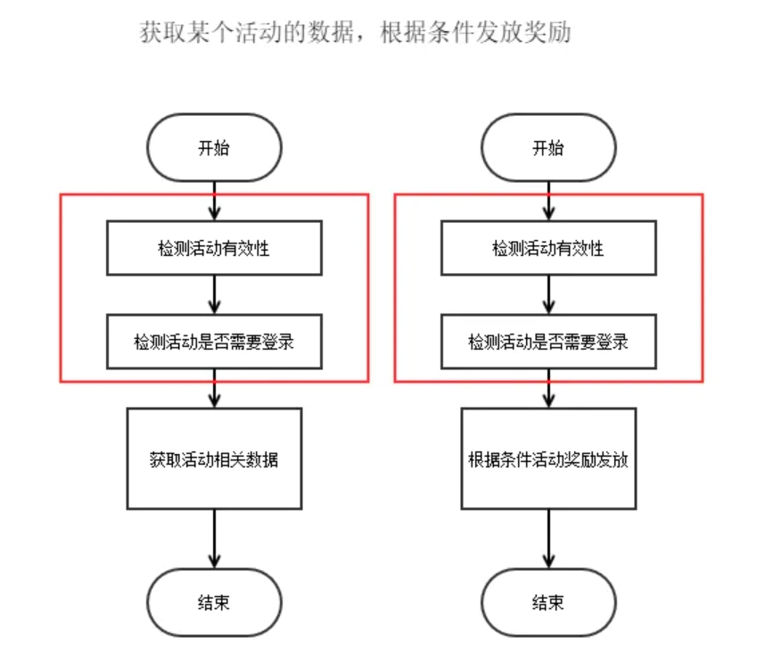
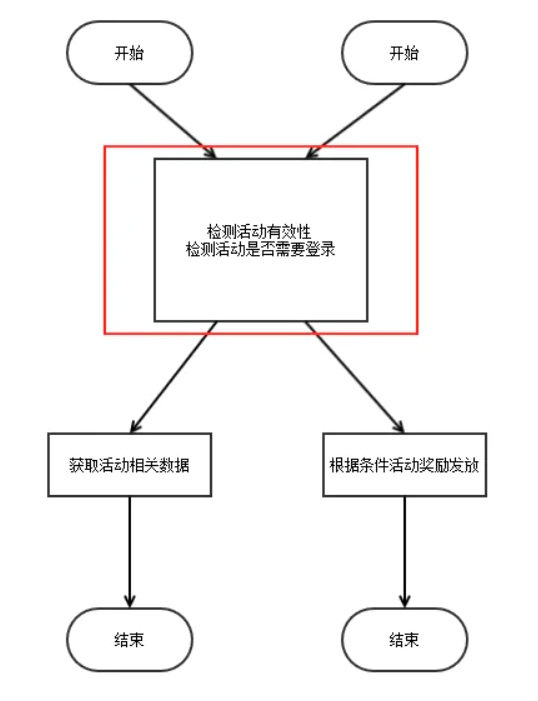
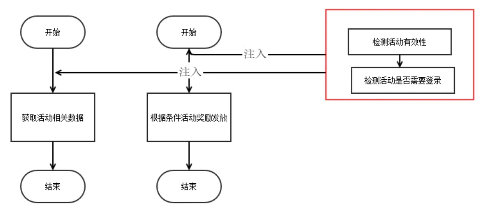

# 1 Spring

## 1.1 什么是 Spring 框架?

​		spring是开源的轻量级框架。我们⼀般说 Spring 框架指的都是 Spring Framework，它是很多模块的集合，使⽤这些模块可以很⽅ 便地协助我们进⾏开发。这些模块是：核⼼容器、数据访问/集成,、Web、AOP（⾯向切⾯编程）、⼯ 具、消息和测试模块。⽐如：Core Container 中的 Core 组件是Spring 所有组件的核⼼，Beans 组件 和 Context 组件是实现IOC和依赖注⼊的基础，AOP组件⽤来实现⾯向切⾯编程。

**Spring 官⽹列出的 Spring 的 6 个特征:**

- **核⼼技术 ：**依赖注⼊(DI)，AOP，事件(events)，资源，i18n，验证，数据绑定，类型转换， SpEL。
- **测试 ：**模拟对象，TestContext框架，Spring MVC 测试，WebTestClient。 
- **数据访问 ：**事务，DAO⽀持，JDBC，ORM，编组XML。 
- **Web⽀持 :** Spring MVC和Spring WebFlux Web框架。 
- **集成 ：**远程处理，JMS，JCA，JMX，电⼦邮件，任务，调度，缓存。 
- **语⾔ ：**Kotlin，Groovy，动态语⾔。

**特点：**

- **方便解耦，简化开发**

　　通过Spring提供的IoC容器，我们可以将对象之间的依赖关系交由Spring进行控制，避免硬编码所造成的过度程序耦合。有了Spring，用户不必再为单实例模式类、属性文件解析等这些很底层的需求编写代码，可以更专注于上层的应用。

- **AOP编程的支持**

　　通过Spring提供的AOP功能，方便进行面向切面的编程，许多不容易用传统OOP实现的功能可以通过AOP轻松应付。

- **声明事物的支持**

　　在Spring中，我们可以从单调烦闷的事务管理代码中解脱出来，通过声明式方式灵活地进行事务的管理，提高开发效率和质量。

- **方便程序的测试**

　　可以用非容器依赖的编程方式进行几乎所有的测试工作，在Spring里，测试不再是昂贵的操作，而是随手可做的事情。例如：Spring对Junit4支持，可以通过注解方便的测试Spring程序。

- **方便集成各种优秀框架**

　　Spring不排斥各种优秀的开源框架，相反，Spring可以降低各种框架的使用难度，Spring提供了对各种优秀框架（如Struts,Hibernate、Hessian、Quartz）等的直接支持。

- **降低Java EE API的使用难度**

　　Spring对很多难用的Java EE API（如JDBC，JavaMail，远程调用等）提供了一个薄薄的封装层，通过Spring的简易封装，这些Java EE API的使用难度大为降低。

- **Java 源码是经典学习范例**

　　　　Spring的源码设计精妙、结构清晰、匠心独用，处处体现着大师对Java设计模式灵活运用以及对Java技术的高深造诣。Spring框架源码无疑是Java技术的最佳实践范例。如果想在短时间内迅速提高自己的Java技术水平和应用开发水平，学习和研究Spring源码将会使你收到意想不到的效果。

## 1.2 AOP和IOC

### AOP(Aspect-Oriented Programming，面向切面编程)

**参考**

> - [Spring之AOP](https://www.jianshu.com/p/570c5283b1fc)
> - [轻松理解AOP思想(面向切面编程)](https://www.cnblogs.com/Wolfmanlq/p/6036019.html)
> - [AOP 那点事儿](https://my.oschina.net/huangyong/blog/161338)
> - [OOP的完美点缀—AOP之SpringAOP实现原理](https://www.cnblogs.com/chenjunping/p/6664454.html)
> - [Spring之AOP](https://www.cnblogs.com/xiaoxi/p/5945707.html)

​		面向切面编程，通过**预编译方式**和**运行期动态代理**实现程序功能的统一维护的一种技术。AOP是OOP的延续，是软件开发中的一个 热点，也是Spring框架中的一个重要内容，是函数式编程的一种衍生范型。利用AOP可以对业务逻辑 的各个部分进行隔离，从而使得业务逻辑各部分之间的耦合度降低，提高程序的可重用性，同时提高 了开发的效率。

​		要理解切面编程，就需要先理解什么是切面。用刀把一个西瓜分成两瓣，切开的切口就是切面；炒菜，锅与炉子共同来完成炒菜，锅与炉子就是切面。web层级设计中，web层->网关层->服务层->数据层，每一层之间也是一个切面。**编程中，对象与对象之间，方法与方法之间，模块与模块之间都是一个个切面。**

**实例理解：**

1.我们一般做活动的时候，一般对每一个接口都会做活动的有效性校验（是否开始、是否结束等等）、以及这个接口是不是需要用户登录。

2.这有个问题就是，有多少接口，就要多少次代码copy。对于一个“懒人”，这是不可容忍的。好，提出一个公共方法，每个接口都来调用这个接口。这里有点切面的味道了。

3.同样有个问题，我虽然不用每次都copy代码了，但是，每个接口总得要调用这个方法吧。于是就有了**切面**的概念，我将方法注入到接口调用的某个地方**（切点）**。这样接口只需要关心具体的业务，而不需要关注其他非该接口关注的逻辑或处理。

**概念&关键词**

- **连接点（Join point）：**程序执行的某个特定位置：如类开始初始化之前、类初始化之后、类某个方法调用前、调用后等；一个类或一段程序代码拥有一些具有边界性质的特定点，这些代码中的特定点就成为“连接点”，**<u>Spring仅支持方法的连接点，即仅能在方法调用前、方法调用后以及方法调用前后的这些程序执行点织入增强</u>**。比如：黑客攻击系统需要找到突破口，没有突破口就没有办法攻击，从某种程度上来说，AOP就是一个黑客，连接点就是AOP向目标类攻击的候选点。
- **切点（Point cut）：**每个程序类都拥有许多连接点，如一个拥有两个方法的类，这两个方法都是连接点，即连接点是程序类中客观存在的事物。但在为数众多的连接点中，如何定位到某个连接点上呢？AOP通过切点定位特定连接点。`通过数据库查询的概念来理解切点和连接点：连接点相当于数据库表中的记录，而切点相当于查询条件`。**<u>连接点和切点不是一一对应的关系，一个切点可以匹配多个连接点</u>**。

# SpringCloud

​		微服务架构就是将单体的应用程序分成多个应用程序,这多个应用程序就成为微服务,每个微服务运行在自己的进程中,并使用轻量级的机制通信。这些服务围绕业务能力来划分,并通过自动化部署机制来独立部署。这些服务可以使用不同的编程语言,不同数据库,以保证最低限度的集中式管理。

  

## SpringCloud优缺点

### 优点

1. **服务拆分粒度更细，有利于资源重复利用，有利于提高开发效率**
2. **可以更精准的制定优化服务方案，提高系统的可维护性**
3. **微服务架构采用去中心化思想，服务之间采用Restful等轻量级通讯，比ESB更轻量**
4. **适于互联网时代，产品迭代周期更短**

### 缺点

1. 微服务过多，治理成本高，不利于维护系统
2. 分布式系统开发的成本高（容错，分布式事务等）对团队挑战大

总的来说优点大过于缺点，目前看来SpringCloud是一套非常完善的分布式框架，目前很多企业开始用微服务

## SpringBoot和SpringCloud区别

## SpringCloud组成

- SpringCloud Eureka：服务发现与注册
- SpringCloud Hystrix：熔断器
- SpringCloud Ribbon：负载均衡
- SpringCloud Zuul：路由网关
- SpringCloud Config：分布式统一配置
- SpringCloud Feign：声明性的Web服务客户端

等20多个开源框架